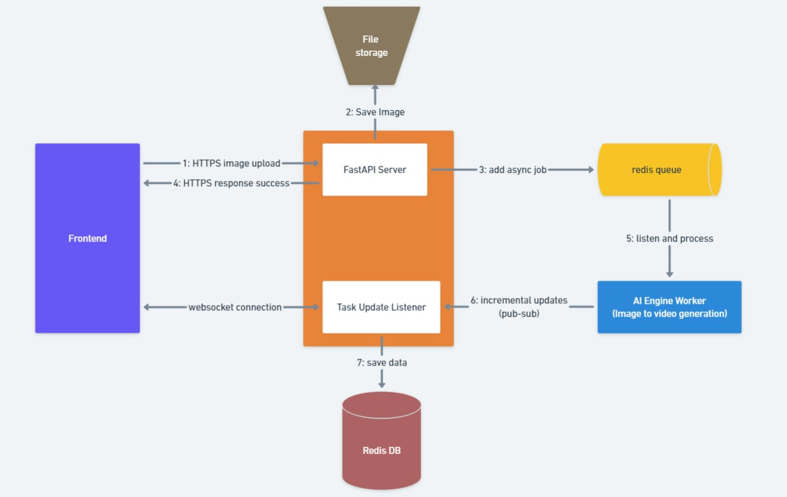

# Full stack technical challenge

## Techstack used: 
- React
- FastAPI
- Redis
- Redis Queue

## Image to video

### demo
<video width="320" height="240" controls>
  <source src="./media/image-video-challenge.mp4" type="video/mp4">
</video>


https://github.com/ysskrishna/video-generation-ai-pipeline/assets/26503640/955f6f95-b90a-4015-a406-ae941855afe2


## pipeline diagram



## Start containers
```
docker compose up --build
```

## Frontend url
```
http://localhost:5173/
```
