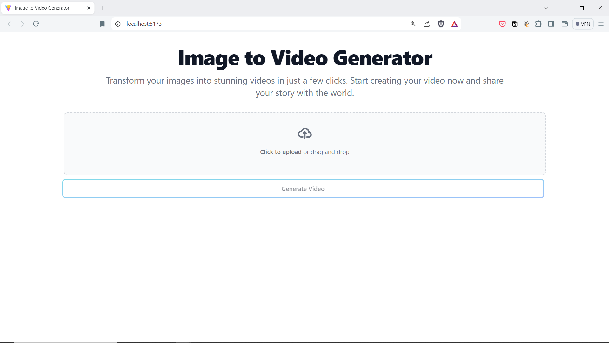
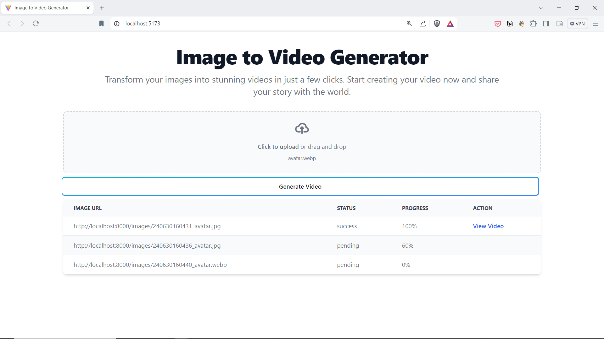

# Image to Video Generation Pipeline
A full stack application which allows users to demonstrate a image to video generation pipeline using distributed systems

## Techstack used: 
- React
- Tailwindcss
- Websockets
- FastAPI
- Redis
- Redis Queue
- Docker

## Pipeline Diagram
This diagram illustrates the workflow of the image to video generation process


## Demo




<video width="320" height="240" controls>
  <source src="./media/image-video-generator-demo.mp4" type="video/mp4">
</video>


https://github.com/ysskrishna/video-generation-ai-pipeline/assets/26503640/955f6f95-b90a-4015-a406-ae941855afe2


## Project Configuration
Before running the project, make sure to adjust the following configuration files:

### Backend Configuration
- Adjust the `.env` file located in the backend folder if any environment variables need modification.

### Frontend Configuration
- Adjust the `config.js` file located in the `frontend/src` folder to configure frontend-specific settings as necessary.


## Start Containers
To start the project, use Docker Compose to build and run the containers:
```
docker compose up --build
```

### Frontend URL
Once the containers are running, you can access the frontend application at:
```
http://localhost:5173/
```

### Backend URL
Once the containers are running, you can access the backend application at:
```
http://localhost:8000/
```
